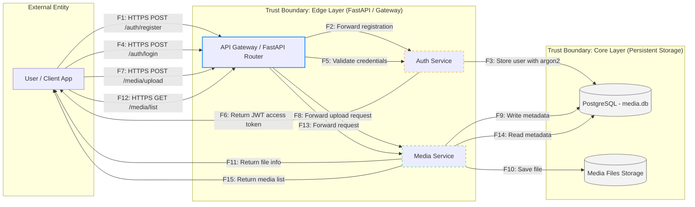

# Data Flow Diagram (DFD) — Media Catalog Service

## Overview

Диаграмма отражает потоки данных между пользователем, API Gateway, сервисами аутентификации и управления медиа, а также хранилищем данных и файлов.
Границы доверия (Trust Boundaries) выделены для Edge и Core уровней системы.

---

## DFD — Main Scenario

| ID потока | Направление              | Протокол     | Конечная точка     | Описание |
|------------|--------------------------|---------------|--------------------|-----------|
| F1 | Пользователь → Шлюз | HTTPS POST | /auth/register | Запрос регистрации с учётными данными |
| F2 | Шлюз → Аутентификация | Внутренний | – | Передача данных регистрации |
| F3 | Аутентификация → БД | SQL INSERT | – | Сохранение пользователя с хешем пароля (argon2id) |
| F4 | Пользователь → Шлюз | HTTPS POST | /auth/login | Запрос входа с учётными данными |
| F5 | Шлюз → Аутентификация | Внутренний | – | Проверка учётных данных пользователя |
| F6 | Аутентификация → Пользователь | HTTPS Response | – | Возврат JWT access token |

| ID потока | Направление              | Протокол     | Конечная точка     | Описание |
|------------|--------------------------|---------------|--------------------|-----------|
| F7 | Пользователь → Шлюз | HTTPS POST | /media/upload | Загрузка медиафайла (JWT аутентификация) |
| F8 | Шлюз → Медиа | Внутренний | – | Передача запроса на загрузку |
| F9 | Медиа → БД | SQL INSERT | – | Запись метаданных файла в PostgreSQL |
| F10 | Медиа → Хранилище | Запись файла | – | Сохранение медиафайла в хранилище |
| F11 | Медиа → Пользователь | HTTPS Response | – | Возврат информации о файле и URL |
| F12 | Пользователь → Шлюз | HTTPS GET | /media/list | Запрос списка медиа (JWT аутентификация) |
| F13 | Шлюз → Медиа | Внутренний | – | Передача запроса списка |
| F14 | Медиа → БД | SQL SELECT | – | Чтение метаданных из базы данных |
| F15 | Медиа → Пользователь | HTTPS Response | – | Возврат списка медиафайлов |
